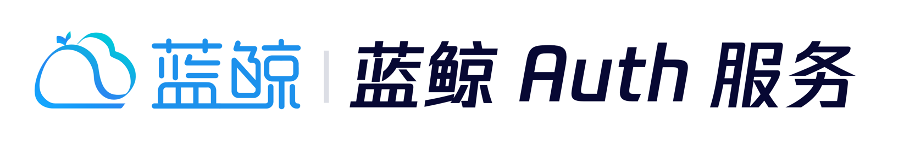

---

 

简体中文 | [English](README_EN.md)

## 概览

提供一套标准的OAuth2流程, 可以支持access_token的授权/生成/生命周期管理等, 并且包含scope由于被调用方做一些权限控制且统一纳管.

## 功能特性

- 提供 Client 统一管理服务
- 管理 Client 访问网关的权限
- 支持 OAuth2: authorization code
- 提供 access_token 生命周期管理

## 快速开始

- [本地开发部署指引](docs/DEVELOP_GUIDE.md)

## 支持

- [蓝鲸 API 网关产品白皮书](https://bk.tencent.com/docs/document/7.0/171/13974)
- [蓝鲸智云 - 学习社区](https://bk.tencent.com/s-mart/community)
- [蓝鲸 DevOps 在线视频教程](https://bk.tencent.com/s-mart/video)
- 加入技术交流 QQ 群：

## 蓝鲸社区

- [BK-CI](https://github.com/TencentBlueKing/bk-ci)：蓝鲸持续集成平台是一个开源的持续集成和持续交付系统，可以轻松将你的研发流程呈现到你面前。
- [BK-BCS](https://github.com/TencentBlueKing/bk-bcs)：蓝鲸容器管理平台是以容器技术为基础，为微服务业务提供编排管理的基础服务平台。
- [BK-SOPS](https://github.com/TencentBlueKing/bk-sops)：标准运维（SOPS）是通过可视化的图形界面进行任务流程编排和执行的系统，是蓝鲸体系中一款轻量级的调度编排类
  SaaS 产品。
- [BK-CMDB](https://github.com/TencentBlueKing/bk-cmdb)：蓝鲸配置平台是一个面向资产及应用的企业级配置管理平台。
- [BK-JOB](https://github.com/TencentBlueKing/bk-job)：蓝鲸作业平台（Job）是一套运维脚本管理系统，具备海量任务并发处理能力。

## 贡献

如果你有好的意见或建议，欢迎给我们提 Issues 或 PullRequests，为蓝鲸开源社区贡献力量。关于分支 / Issue 及 PR,
请查看 [CONTRIBUTING](docs/CONTRIBUTING.md)。

[腾讯开源激励计划](https://opensource.tencent.com/contribution) 鼓励开发者的参与和贡献，期待你的加入。
